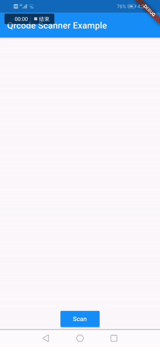

Language: [English](README.md) | [中文简体](README-ZH.md)

# QR Code Scanner
  
[![License][license-image]][license-url] 
[](https://pub.dartlang.org/packages/qrscan)

A Flutter plugin 🛠 to scanning. Ready for Android 🚀

[github](https://github.com/leyan95/qrcode_scanner)



## Permission：
```xml
<uses-permission android:name="android.permission.CAMERA" />
<uses-permission android:name="android.permission.WRITE_EXTERNAL_STORAGE"/>
<uses-permission android:name="android.permission.READ_EXTERNAL_STORAGE"/>
```

## Installation

Add this to your package's pubspec.yaml file:

```yaml
dependencies:
 qrscan: ^0.2.18
```

## Scan Usage example
```dart
import 'package:qrscan/qrscan.dart' as scanner;

String cameraScanResult = await scanner.scan();
```

## Supported

-  [x] Scan BR-CODE
-  [x] Scan QR-CODE
-  [x] Control the flash while scanning
-  [x] Apply for camera privileges
-  [x] Scanning BR-CODE or QR-CODE in albums
-  [x] Parse to code string with uint8list
-  [x] Scanning the image of the specified path
-  [x] Display the switch button of the flashlight according to the light intensity
-  [x] Generate QR-CODE

## Features

-  Generate BR-CODE

## TODO

-  [] Support IOS (example builds, but invoking scanner does not return)
-  [] Provide iOS setup documentation, if necessary

## Demo App


## Select Bar-Code or QR-Code photos for analysis and Generating QR-Code 
```dart
import 'package:qrscan/qrscan.dart' as scanner;

// Select Bar-Code or QR-Code photos for analysis
String photoScanResult = await scanner.scanPhoto();

// Generating QR-Code
Uint8List result = await scanner.generateBarCode('https://github.com/leyan95/qrcode_scanner');

// Scanning the image of the specified path
String barcode = await scanner.scanPath(path);

// Parse to code string with uint8list
File file = await ImagePicker.pickImage(source: ImageSource.camera);
Uint8List bytes = file.readAsBytesSync();
String barcode = await scanner.scanBytes(uint8list);
```

## Contribute

We would ❤️ to see your contribution!

## License

Distributed under the MIT license. See ``LICENSE`` for more information.

## About

Created by Shusheng.

[license-image]: https://img.shields.io/badge/License-MIT-blue.svg
[license-url]: LICENSE
